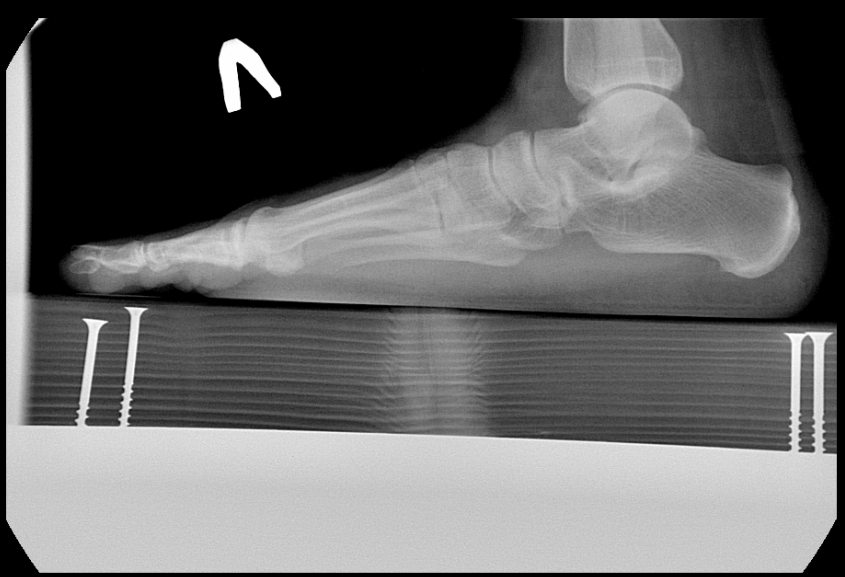
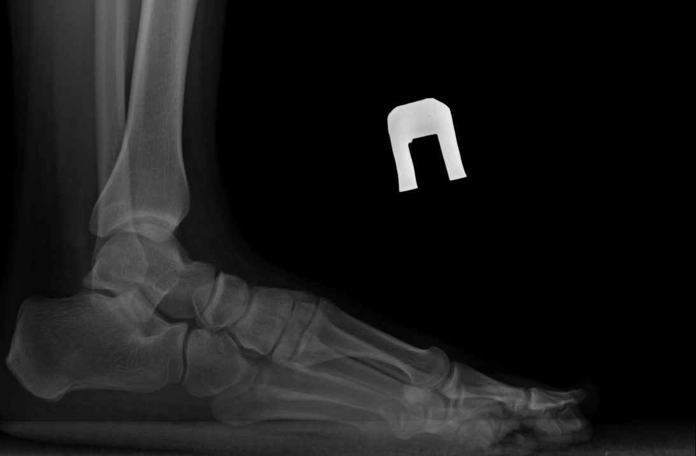

## Постановка задачи.
- Реализовать алгоритм распознавания символов «Л»/«П» на рентгеновских снимках стопы (пример ниже)

<p align="center">
 
</p>

<p align="center">
 
</p>

- поиск местоположения симовла на картинке
- выделение сегмента символа
- идентификация символа (Л или П)

## 1. Разметка и обучение модели
Для обучения использовался датасет из 200 рентгенографических изображений стопы (180 на обучение и 20 на валидацию)
Разметка проводилась с использованием интрумента `CVAT`. Размечалось два класса символов('Л' и 'П') с последующей выгрузкой анотаций в формате для YOLO.

Перед обучением была создана структура каталогов тренировочного и валидационного
датасета следующего содержания (структура находится в директории `notebooks/`):

```
yolo.yaml
data/
    ├── images/
        ├── train/ 
        └── val/
    ├── labels/
        ├── train/ 
        └── val/
```

__Примечание: Изображения и разметка для обучения в папках отсутствует__

Конфигурационный файл `notebooks/yolo.yaml` содержит информацию для обучения с путями к папкам и название классов

Для обучения использовались библиотека `Ultralitics` с `YOLOv8`.

Скрипт обучения находится в ноутбуке `notebooks/train.ipunb`.

Скрипт для предсказания находится ноутбуке `notebooks/predict.ipunb`

## Тестовый интерфейс FasAPI

Можно заустить скрипт `python app/main` на локальной машине и в браузере перейти по `http://0.0.0.0:8058/docs`

